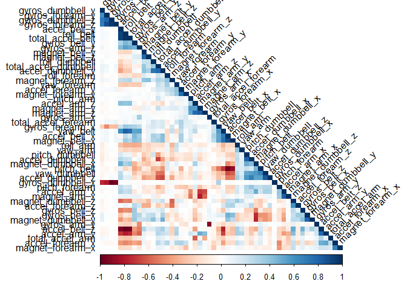
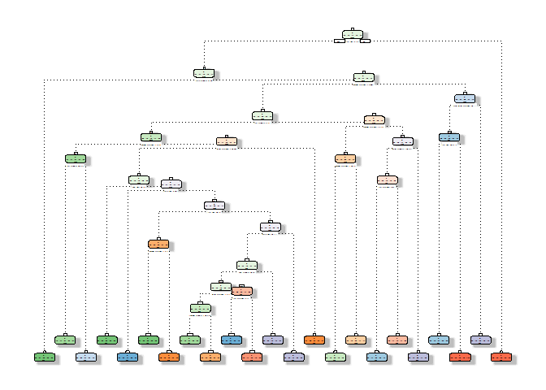

## Introduction
This report is produced as part of the course project for the Practical Machine Learning course in Coursera's Data Science Specialization

The goal is to use data from accelerometers on the belt, forearm, arm, and dumbell of 6 participants to predict the manner in which exercises are done. The quality or manner of the exercises performed is contained in the variable "classe", which has 5 possible values. More information on the data can be found in the section *Weight Lifting Exercise Dataset* of [this website](http://web.archive.org/web/20161224072740/http:/groupware.les.inf.puc-rio.br/har).

At the end of the report, the resulting best prediction model is applied to a set of 20 test cases. These results will be submitted to the Course Project Prediction Quiz for automatic grading.


## Exploratory data analysis and data cleaning

Load required packages.


```r
library(caret)
library(corrplot)
library(rattle)
library(rpart)
```

Load data. Note that the validation data set contains the 20 test sets for the coursera submission.


```r
rm(list=ls())
if(!file.exists("data/pml-training.csv")){
  download.file("https://d396qusza40orc.cloudfront.net/predmachlearn/pml-training.csv", "data/pml-training.csv")
}
data<- read.csv("data/pml-training.csv")

if(!file.exists("data/pml-testing.csv")){
  download.file("https://d396qusza40orc.cloudfront.net/predmachlearn/pml-testing.csv", "data/pml-testing.csv")
}
validation <- read.csv("data/pml-testing.csv")
```

Split the data into training and testing sets. The seed is set to ensure reproducibility. Note that the exploratory analysis is only performed on the training set since the testing data should only be used for model assessment, never for model training. 


```r
set.seed(1234)
inTrain<-createDataPartition(y=data$classe, p=0.6, list=FALSE)

training<-data[inTrain,]
testing<-data[-inTrain,]

str(training)
```

```
## 'data.frame':	11776 obs. of  160 variables:
##  $ X                       : int  3 4 5 7 9 10 11 13 14 15 ...
##  $ user_name               : Factor w/ 6 levels "adelmo","carlitos",..: 2 2 2 2 2 2 2 2 2 2 ...
##  $ raw_timestamp_part_1    : int  1323084231 1323084232 1323084232 1323084232 1323084232 1323084232 1323084232 1323084232 1323084232 1323084232 ...
##  $ raw_timestamp_part_2    : int  820366 120339 196328 368296 484323 484434 500302 560359 576390 604281 ...
##  $ cvtd_timestamp          : Factor w/ 20 levels "02/12/2011 13:32",..: 9 9 9 9 9 9 9 9 9 9 ...
##  $ new_window              : Factor w/ 2 levels "no","yes": 1 1 1 1 1 1 1 1 1 1 ...
##  $ num_window              : int  11 12 12 12 12 12 12 12 12 12 ...
##  $ roll_belt               : num  1.42 1.48 1.48 1.42 1.43 1.45 1.45 1.42 1.42 1.45 ...
##  $ pitch_belt              : num  8.07 8.05 8.07 8.09 8.16 8.17 8.18 8.2 8.21 8.2 ...
##  $ yaw_belt                : num  -94.4 -94.4 -94.4 -94.4 -94.4 -94.4 -94.4 -94.4 -94.4 -94.4 ...
##  $ total_accel_belt        : int  3 3 3 3 3 3 3 3 3 3 ...
##  $ kurtosis_roll_belt      : Factor w/ 397 levels "","-0.016850",..: 1 1 1 1 1 1 1 1 1 1 ...
##  $ kurtosis_picth_belt     : Factor w/ 317 levels "","-0.021887",..: 1 1 1 1 1 1 1 1 1 1 ...
##  $ kurtosis_yaw_belt       : Factor w/ 2 levels "","#DIV/0!": 1 1 1 1 1 1 1 1 1 1 ...
##  $ skewness_roll_belt      : Factor w/ 395 levels "","-0.003095",..: 1 1 1 1 1 1 1 1 1 1 ...
##  $ skewness_roll_belt.1    : Factor w/ 338 levels "","-0.005928",..: 1 1 1 1 1 1 1 1 1 1 ...
##  $ skewness_yaw_belt       : Factor w/ 2 levels "","#DIV/0!": 1 1 1 1 1 1 1 1 1 1 ...
##  $ max_roll_belt           : num  NA NA NA NA NA NA NA NA NA NA ...
##  $ max_picth_belt          : int  NA NA NA NA NA NA NA NA NA NA ...
##  $ max_yaw_belt            : Factor w/ 68 levels "","-0.1","-0.2",..: 1 1 1 1 1 1 1 1 1 1 ...
##  $ min_roll_belt           : num  NA NA NA NA NA NA NA NA NA NA ...
##  $ min_pitch_belt          : int  NA NA NA NA NA NA NA NA NA NA ...
##  $ min_yaw_belt            : Factor w/ 68 levels "","-0.1","-0.2",..: 1 1 1 1 1 1 1 1 1 1 ...
##  $ amplitude_roll_belt     : num  NA NA NA NA NA NA NA NA NA NA ...
##  $ amplitude_pitch_belt    : int  NA NA NA NA NA NA NA NA NA NA ...
##  $ amplitude_yaw_belt      : Factor w/ 4 levels "","#DIV/0!","0.00",..: 1 1 1 1 1 1 1 1 1 1 ...
##  $ var_total_accel_belt    : num  NA NA NA NA NA NA NA NA NA NA ...
##  $ avg_roll_belt           : num  NA NA NA NA NA NA NA NA NA NA ...
##  $ stddev_roll_belt        : num  NA NA NA NA NA NA NA NA NA NA ...
##  $ var_roll_belt           : num  NA NA NA NA NA NA NA NA NA NA ...
##  $ avg_pitch_belt          : num  NA NA NA NA NA NA NA NA NA NA ...
##  $ stddev_pitch_belt       : num  NA NA NA NA NA NA NA NA NA NA ...
##  $ var_pitch_belt          : num  NA NA NA NA NA NA NA NA NA NA ...
##  $ avg_yaw_belt            : num  NA NA NA NA NA NA NA NA NA NA ...
##  $ stddev_yaw_belt         : num  NA NA NA NA NA NA NA NA NA NA ...
##  $ var_yaw_belt            : num  NA NA NA NA NA NA NA NA NA NA ...
##  $ gyros_belt_x            : num  0 0.02 0.02 0.02 0.02 0.03 0.03 0.02 0.02 0 ...
##  $ gyros_belt_y            : num  0 0 0.02 0 0 0 0 0 0 0 ...
##  $ gyros_belt_z            : num  -0.02 -0.03 -0.02 -0.02 -0.02 0 -0.02 0 -0.02 0 ...
##  $ accel_belt_x            : int  -20 -22 -21 -22 -20 -21 -21 -22 -22 -21 ...
##  $ accel_belt_y            : int  5 3 2 3 2 4 2 4 4 2 ...
##  $ accel_belt_z            : int  23 21 24 21 24 22 23 21 21 22 ...
##  $ magnet_belt_x           : int  -2 -6 -6 -4 1 -3 -5 -3 -8 -1 ...
##  $ magnet_belt_y           : int  600 604 600 599 602 609 596 606 598 597 ...
##  $ magnet_belt_z           : int  -305 -310 -302 -311 -312 -308 -317 -309 -310 -310 ...
##  $ roll_arm                : num  -128 -128 -128 -128 -128 -128 -128 -128 -128 -129 ...
##  $ pitch_arm               : num  22.5 22.1 22.1 21.9 21.7 21.6 21.5 21.4 21.4 21.4 ...
##  $ yaw_arm                 : num  -161 -161 -161 -161 -161 -161 -161 -161 -161 -161 ...
##  $ total_accel_arm         : int  34 34 34 34 34 34 34 34 34 34 ...
##  $ var_accel_arm           : num  NA NA NA NA NA NA NA NA NA NA ...
##  $ avg_roll_arm            : num  NA NA NA NA NA NA NA NA NA NA ...
##  $ stddev_roll_arm         : num  NA NA NA NA NA NA NA NA NA NA ...
##  $ var_roll_arm            : num  NA NA NA NA NA NA NA NA NA NA ...
##  $ avg_pitch_arm           : num  NA NA NA NA NA NA NA NA NA NA ...
##  $ stddev_pitch_arm        : num  NA NA NA NA NA NA NA NA NA NA ...
##  $ var_pitch_arm           : num  NA NA NA NA NA NA NA NA NA NA ...
##  $ avg_yaw_arm             : num  NA NA NA NA NA NA NA NA NA NA ...
##  $ stddev_yaw_arm          : num  NA NA NA NA NA NA NA NA NA NA ...
##  $ var_yaw_arm             : num  NA NA NA NA NA NA NA NA NA NA ...
##  $ gyros_arm_x             : num  0.02 0.02 0 0 0.02 0.02 0.02 0.02 0.02 0.02 ...
##  $ gyros_arm_y             : num  -0.02 -0.03 -0.03 -0.03 -0.03 -0.03 -0.03 -0.02 0 0 ...
##  $ gyros_arm_z             : num  -0.02 0.02 0 0 -0.02 -0.02 0 -0.02 -0.03 -0.03 ...
##  $ accel_arm_x             : int  -289 -289 -289 -289 -288 -288 -290 -287 -288 -289 ...
##  $ accel_arm_y             : int  110 111 111 111 109 110 110 111 111 111 ...
##  $ accel_arm_z             : int  -126 -123 -123 -125 -122 -124 -123 -124 -124 -124 ...
##  $ magnet_arm_x            : int  -368 -372 -374 -373 -369 -376 -366 -372 -371 -374 ...
##  $ magnet_arm_y            : int  344 344 337 336 341 334 339 338 331 342 ...
##  $ magnet_arm_z            : int  513 512 506 509 518 516 509 509 523 510 ...
##  $ kurtosis_roll_arm       : Factor w/ 330 levels "","-0.02438",..: 1 1 1 1 1 1 1 1 1 1 ...
##  $ kurtosis_picth_arm      : Factor w/ 328 levels "","-0.00484",..: 1 1 1 1 1 1 1 1 1 1 ...
##  $ kurtosis_yaw_arm        : Factor w/ 395 levels "","-0.01548",..: 1 1 1 1 1 1 1 1 1 1 ...
##  $ skewness_roll_arm       : Factor w/ 331 levels "","-0.00051",..: 1 1 1 1 1 1 1 1 1 1 ...
##  $ skewness_pitch_arm      : Factor w/ 328 levels "","-0.00184",..: 1 1 1 1 1 1 1 1 1 1 ...
##  $ skewness_yaw_arm        : Factor w/ 395 levels "","-0.00311",..: 1 1 1 1 1 1 1 1 1 1 ...
##  $ max_roll_arm            : num  NA NA NA NA NA NA NA NA NA NA ...
##  $ max_picth_arm           : num  NA NA NA NA NA NA NA NA NA NA ...
##  $ max_yaw_arm             : int  NA NA NA NA NA NA NA NA NA NA ...
##  $ min_roll_arm            : num  NA NA NA NA NA NA NA NA NA NA ...
##  $ min_pitch_arm           : num  NA NA NA NA NA NA NA NA NA NA ...
##  $ min_yaw_arm             : int  NA NA NA NA NA NA NA NA NA NA ...
##  $ amplitude_roll_arm      : num  NA NA NA NA NA NA NA NA NA NA ...
##  $ amplitude_pitch_arm     : num  NA NA NA NA NA NA NA NA NA NA ...
##  $ amplitude_yaw_arm       : int  NA NA NA NA NA NA NA NA NA NA ...
##  $ roll_dumbbell           : num  12.9 13.4 13.4 13.1 13.2 ...
##  $ pitch_dumbbell          : num  -70.3 -70.4 -70.4 -70.2 -70.4 ...
##  $ yaw_dumbbell            : num  -85.1 -84.9 -84.9 -85.1 -84.9 ...
##  $ kurtosis_roll_dumbbell  : Factor w/ 398 levels "","-0.0035","-0.0073",..: 1 1 1 1 1 1 1 1 1 1 ...
##  $ kurtosis_picth_dumbbell : Factor w/ 401 levels "","-0.0163","-0.0233",..: 1 1 1 1 1 1 1 1 1 1 ...
##  $ kurtosis_yaw_dumbbell   : Factor w/ 2 levels "","#DIV/0!": 1 1 1 1 1 1 1 1 1 1 ...
##  $ skewness_roll_dumbbell  : Factor w/ 401 levels "","-0.0082","-0.0096",..: 1 1 1 1 1 1 1 1 1 1 ...
##  $ skewness_pitch_dumbbell : Factor w/ 402 levels "","-0.0053","-0.0084",..: 1 1 1 1 1 1 1 1 1 1 ...
##  $ skewness_yaw_dumbbell   : Factor w/ 2 levels "","#DIV/0!": 1 1 1 1 1 1 1 1 1 1 ...
##  $ max_roll_dumbbell       : num  NA NA NA NA NA NA NA NA NA NA ...
##  $ max_picth_dumbbell      : num  NA NA NA NA NA NA NA NA NA NA ...
##  $ max_yaw_dumbbell        : Factor w/ 73 levels "","-0.1","-0.2",..: 1 1 1 1 1 1 1 1 1 1 ...
##  $ min_roll_dumbbell       : num  NA NA NA NA NA NA NA NA NA NA ...
##  $ min_pitch_dumbbell      : num  NA NA NA NA NA NA NA NA NA NA ...
##  $ min_yaw_dumbbell        : Factor w/ 73 levels "","-0.1","-0.2",..: 1 1 1 1 1 1 1 1 1 1 ...
##  $ amplitude_roll_dumbbell : num  NA NA NA NA NA NA NA NA NA NA ...
##   [list output truncated]
```

To avoid overfitting and to shorten the training time, the raw dataset will be shrunk.

First of all, the variables with near zero variance are removed since they will not provide much information about the outcome. It can also be seen that some columns contain many NAs. Therefore, all the columns where the percentage of NAs is over 95% are removed too. The assessment of which variables these two conditions apply to is performed only on the training set but they are also removed from the testing and validation data.


```r
# Remove NZV 
nzv_idx <- nearZeroVar(training)

training<-training[,-nzv_idx]
testing<-testing[,-nzv_idx]
validation<-validation[,-nzv_idx]

# Remove NAs
nas_idx <- colSums(is.na(training))/nrow(training) > 0.95

training<-training[,nas_idx==FALSE]
testing<-testing[,nas_idx==FALSE]
validation<-validation[,nas_idx==FALSE]
```

Finally the first 6 columns of the datasets are removed. The prediction of the manner in which each exercise is performed shall be based on accelerometer measurements and not on timestamps and/or user information, which corresponds to be first 6 columns of data. It is highly likely that each user has performed the exercises in a sequencial order. In this case, the machine learning algorithm would detect this pattern. This would result in the time of day having a big impact on the predicted "classe". However, we know this should not be taken into account. To avoid detecting this or other irrelevant patterns, all the time and user information is removed.


```r
training<-training[,-(1:6)]
testing<-testing[,-(1:6)]
validation<-validation[,-(1:6)]
```

The resulting reduced dataset contains 53 variables out of which 52 are predictors and the 53rd is the variable to be predicted, "classe".

Before jumping into model building, a last analysis on the correlation among variables is performed. High correlated variables usually tend to contain similar information. This is why, it is quite common to remove them. However, in this dataset only 4 variables have a correlation over 0.95. Keeping or removing them should not have a big impact. Therefore, they will be kept in the data sets. The effect of removing highly correlated variables will be shown in the model building section, where two random forest algorithms will be built with and without preprocessing the data with PCA (Principal Component Analysis).


```r
corMatrix<-cor(training[,-53]) # remove classe from correlation matrix.
corHigh <- findCorrelation(corMatrix, cutoff = 0.95); # find variables with correlation higher than 0.95
names(training[,corHigh]) 
```

```
## [1] "accel_belt_z"     "roll_belt"        "accel_belt_x"     "gyros_dumbbell_z"
```

```r
corrplot(corMatrix, type = "lower", order = "hclust", tl.col = "black", method = "color", tl.srt = 45, sub="hj")
```

<!-- -->

## Model Building

In this section the prediction model will be built. To be able to select the best model four different algorithms will be used and the one resulting in the highest out-of-sample accuracy will be chosen. The selected algorithms are:

1. Decision tree.
2. Random forest.
3. Random forest with PCA pre-processing.
4. Generalized Boosted Model (GBM).

The decision tree algorithm has been chosen due to its simplicity and interpretability. Random Forest and Generalized Boosted Model are the most widely used ones and produce highly accurate prediction models. In order to visualize the effect of removing highly correlated features, the Random Forest algorithm will be implemented twice, with and without pre processing the training data with PCA.  


### 1. Decision tree


```r
set.seed(1234)
treeModFit <- rpart(classe ~ ., data=training, method="class") # build model
fancyRpartPlot(treeModFit, sub="")
```

<!-- -->

```r
treePred<-predict(treeModFit, testing, type="class") # predict for testing set
treeCm<-confusionMatrix(treePred, testing$classe); treeCm # calculate confusion matrix 
```

```
## Confusion Matrix and Statistics
## 
##           Reference
## Prediction    A    B    C    D    E
##          A 1930  231   47   81   53
##          B   82  866   67  103  121
##          C   59  189 1062  173  134
##          D   94  118   85  821   70
##          E   67  114  107  108 1064
## 
## Overall Statistics
##                                          
##                Accuracy : 0.732          
##                  95% CI : (0.722, 0.7417)
##     No Information Rate : 0.2845         
##     P-Value [Acc > NIR] : < 2.2e-16      
##                                          
##                   Kappa : 0.6605         
##                                          
##  Mcnemar's Test P-Value : < 2.2e-16      
## 
## Statistics by Class:
## 
##                      Class: A Class: B Class: C Class: D Class: E
## Sensitivity            0.8647   0.5705   0.7763   0.6384   0.7379
## Specificity            0.9266   0.9411   0.9143   0.9441   0.9382
## Pos Pred Value         0.8241   0.6990   0.6568   0.6911   0.7288
## Neg Pred Value         0.9451   0.9013   0.9509   0.9302   0.9408
## Prevalence             0.2845   0.1935   0.1744   0.1639   0.1838
## Detection Rate         0.2460   0.1104   0.1354   0.1046   0.1356
## Detection Prevalence   0.2985   0.1579   0.2061   0.1514   0.1861
## Balanced Accuracy      0.8957   0.7558   0.8453   0.7912   0.8380
```

### 2. Random Forest


```r
set.seed(1234)
startRf <- Sys.time()
rfModFit <- train(classe ~ ., method = "rf", data = training) # build model
endRf <- Sys.time()
timeRf <- endRf - startRf; timeRf
```

```
## Time difference of 43.99667 mins
```

```r
rfPred <- predict(rfModFit,testing) # predict for testing set
rfCm<-confusionMatrix(testing$classe,rfPred); rfCm # calculate confusion matrix 
```

```
## Confusion Matrix and Statistics
## 
##           Reference
## Prediction    A    B    C    D    E
##          A 2231    1    0    0    0
##          B   13 1503    2    0    0
##          C    0   12 1355    1    0
##          D    0    0   20 1265    1
##          E    0    0    4    6 1432
## 
## Overall Statistics
##                                           
##                Accuracy : 0.9924          
##                  95% CI : (0.9902, 0.9942)
##     No Information Rate : 0.286           
##     P-Value [Acc > NIR] : < 2.2e-16       
##                                           
##                   Kappa : 0.9903          
##                                           
##  Mcnemar's Test P-Value : NA              
## 
## Statistics by Class:
## 
##                      Class: A Class: B Class: C Class: D Class: E
## Sensitivity            0.9942   0.9914   0.9812   0.9945   0.9993
## Specificity            0.9998   0.9976   0.9980   0.9968   0.9984
## Pos Pred Value         0.9996   0.9901   0.9905   0.9837   0.9931
## Neg Pred Value         0.9977   0.9979   0.9960   0.9989   0.9998
## Prevalence             0.2860   0.1932   0.1760   0.1621   0.1826
## Detection Rate         0.2843   0.1916   0.1727   0.1612   0.1825
## Detection Prevalence   0.2845   0.1935   0.1744   0.1639   0.1838
## Balanced Accuracy      0.9970   0.9945   0.9896   0.9957   0.9989
```

### 3. Random forest with PCA pre-processing


```r
pca <- preProcess(training[,-53], method = "pca", thresh = 0.5) # Perform PCA. This extracts only the variables that explain 50% of the variance
pcaTraining <- predict(pca, training[,-53])
pcaTraining$classe<-training$classe

set.seed(1234)
startRfPca <- Sys.time()
rfPcaModFit <- train(classe ~ ., method = "rf", data = pcaTraining) # build model
endRfPca <- Sys.time()
timeRfPca <- endRfPca - startRfPca; timeRfPca
```

```
## Time difference of 7.484325 mins
```

```r
rfPcaPred <- predict(rfPcaModFit,predict(pca, testing[,-53])) # predict for testing set
rfPcaCm<-confusionMatrix(testing$classe, rfPcaPred); rfPcaCm # calculate confusion matrix 
```

```
## Confusion Matrix and Statistics
## 
##           Reference
## Prediction    A    B    C    D    E
##          A 1957   83   66   84   42
##          B  113 1206   87   59   53
##          C  104   71 1076   89   28
##          D   50   36  102 1062   36
##          E   42   70   48   67 1215
## 
## Overall Statistics
##                                          
##                Accuracy : 0.8305         
##                  95% CI : (0.822, 0.8387)
##     No Information Rate : 0.2888         
##     P-Value [Acc > NIR] : < 2.2e-16      
##                                          
##                   Kappa : 0.7855         
##                                          
##  Mcnemar's Test P-Value : 1.058e-06      
## 
## Statistics by Class:
## 
##                      Class: A Class: B Class: C Class: D Class: E
## Sensitivity            0.8636   0.8226   0.7803   0.7803   0.8843
## Specificity            0.9507   0.9511   0.9548   0.9655   0.9649
## Pos Pred Value         0.8768   0.7945   0.7865   0.8258   0.8426
## Neg Pred Value         0.9450   0.9589   0.9532   0.9544   0.9752
## Prevalence             0.2888   0.1868   0.1758   0.1735   0.1751
## Detection Rate         0.2494   0.1537   0.1371   0.1354   0.1549
## Detection Prevalence   0.2845   0.1935   0.1744   0.1639   0.1838
## Balanced Accuracy      0.9072   0.8869   0.8676   0.8729   0.9246
```

### 4. Generalized Boosted Model (GBM)


```r
set.seed(1234)
startGbm <- Sys.time()
gbmModFit <- train(classe ~ ., method="gbm", data = training, verbose=F) # build model
endGbm <- Sys.time()
timeGbm <- endGbm - startGbm

gbmPred <- predict(gbmModFit, testing) # predict for testing set
gbmCm<-confusionMatrix(testing$classe, gbmPred); gbmCm # calculate confusion matrix 
```

```
## Confusion Matrix and Statistics
## 
##           Reference
## Prediction    A    B    C    D    E
##          A 2197   22    6    5    2
##          B   50 1438   26    2    2
##          C    0   47 1298   23    0
##          D    0    5   34 1232   15
##          E    3   17   20   25 1377
## 
## Overall Statistics
##                                           
##                Accuracy : 0.9613          
##                  95% CI : (0.9567, 0.9654)
##     No Information Rate : 0.2868          
##     P-Value [Acc > NIR] : < 2.2e-16       
##                                           
##                   Kappa : 0.951           
##                                           
##  Mcnemar's Test P-Value : 2.749e-10       
## 
## Statistics by Class:
## 
##                      Class: A Class: B Class: C Class: D Class: E
## Sensitivity            0.9764   0.9405   0.9379   0.9573   0.9864
## Specificity            0.9937   0.9873   0.9892   0.9918   0.9899
## Pos Pred Value         0.9843   0.9473   0.9488   0.9580   0.9549
## Neg Pred Value         0.9906   0.9856   0.9867   0.9916   0.9970
## Prevalence             0.2868   0.1949   0.1764   0.1640   0.1779
## Detection Rate         0.2800   0.1833   0.1654   0.1570   0.1755
## Detection Prevalence   0.2845   0.1935   0.1744   0.1639   0.1838
## Balanced Accuracy      0.9851   0.9639   0.9635   0.9745   0.9882
```

### Conclusion

Based on the out-of-sample accuracy of the results obtained by predicting the same testing data on all four models, the **Random Forest model** turns out to be the best. The obtained accuracy is 0.9924, in other words, the out-of-sample error is 0.0076. Note that this extra accuracy comes at a computational cost. Hence, the suitability of an algorithm depends on the characteristics and needs of each specific problem. 

## Validation results

The predictions for the validation set have been performed using the ranfom forest model as discussed in the previous section.


```r
results<-predict(rfModFit, newdata=validation); results
```

```
##  [1] B A B A A E D B A A B C B A E E A B B B
## Levels: A B C D E
```

